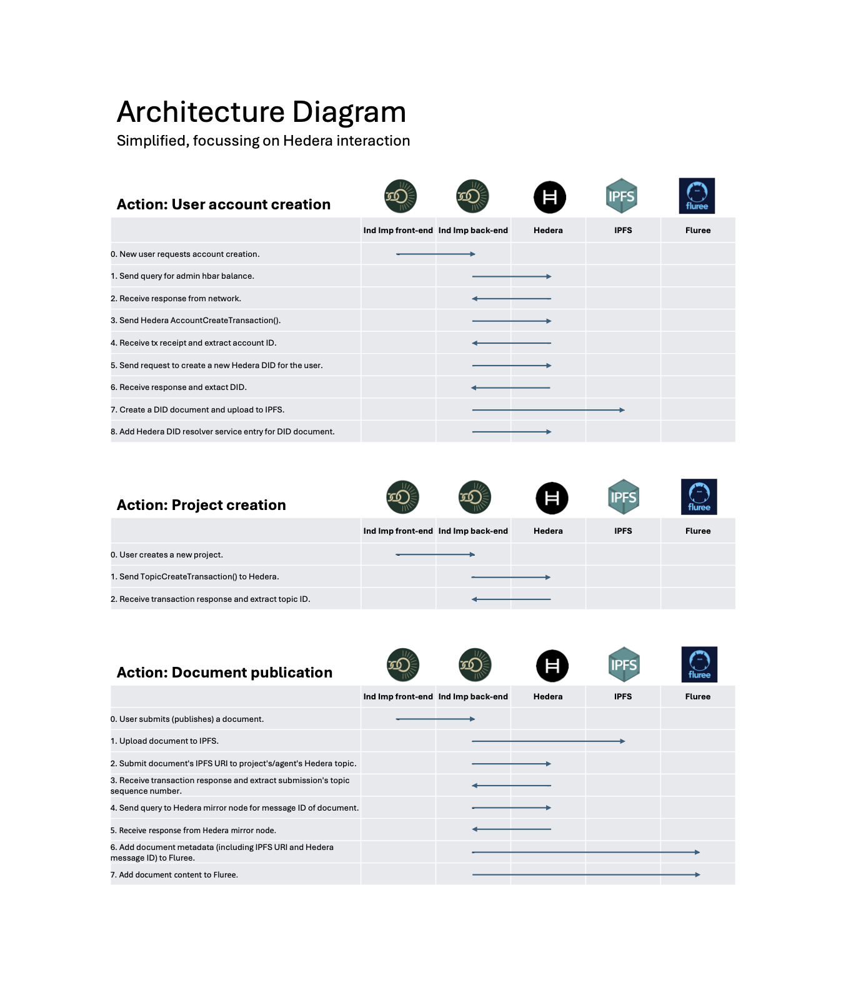

# Independent Impact

This repository contains a submission for the 2025 Hedera Africa Hackathon

## Project Title & Track
- **Title:** Independent Impact
- **Hackathon Track:** 2. DLT for Operations
- **Pitch Deck:** PitchDeck.pdf
- **Hashgraph Developer Course Certification:** [Christiaan Pauw's certificate](https://bafkreiafrgokcpsbjlai5sxkmundbakelz74qgxcu6jj2u27klgrbl3g3u.ipfs.w3s.link/)

## Repository Overview

### System architecture

High-level view of Hedera interactions in Independent Impact Project Development Portal. Data flows from the Shiny UI into R modules that persist state in Postgres / Fluree, sign Hedera transactions through the Hiero SDK, and pin documents to IPFS before recording immutable references on Hedera.



### Project Development Portal (primary focus)
The `ProjectDevelopmentPortal/` directory hosts the Independent Impact Project Development Portal. The portal is also hosted at https://app.independentimpact.org, currently running on testnet. Test it out by creating an account (recommended), or for rapid testing, by logging in as one of the pre-created test users:

* abcde12345@nomail.com with password aBcDe_54321 for a project developer role,  or  
* fghij67890@nomail.com with password fGhIj_09876 for a validator/verifier role

The Project Development Portal provides the infrastructure for designing, validating, and verifying impact projects. Impact projects are any undertaking that is specifically intended to lead to a beneficial impact over and above what would have transpired in the normal course of events. This typically includes greenhouse gas emission reduction projects, but also climate change adaptation, health, and poverty alleviation. 

The app registers agents, orchestrates workflow modules, and logs every action against Hedera Consensus Service and Fluree backends. 

A user registration and verification process establishes an Hedera (currently testnet) account and DID for every user. A project is established via a project listing application, which gives the project an identity. 

Once a user and project have been established, three project-related workflows follow:

* Main Workflow
* PDD Validation Workflow 
* Monitoring Verification Workflow 

#### Running the application

The Project Development Portal in its current form is an R Shiny application connected to a Postgres database for internal state tracking and to a [Fluree](https://flur.ee) Ledger for persistent, queryable user and project data.  

The app sources `global.R`, builds the interface with `shiny`/`shinyjs`, and renders either the login module or the full portal depending on the active session state. The environment template wires key paths, Postgres settings, Fluree defaults, and the Hiero Hedera SDK bindings used throughout the portal.
Bootstrapping scripts provision database tables, ingest workflow metadata, and prepare Hedera operator credentials for downstream transactions.

Hedera-specific operations cover creating project topics, registering DID-backed user identities, and submitting notarised updates. Project onboarding signs a `TopicCreateTransaction`, links admin/submit keys, and stores the resulting topic against the project record. 

Agent enrolment generates Hedera accounts, registers Hiero DIDs, and pushes DID documents to IPFS, ensuring each contributor has a verifiable identifier anchored on Hedera Testnet. Document publication encrypts workflow payloads, decrypts topic keys, and executes `TopicMessageSubmitTransaction` calls before retrieving the mirror-sequenced message ID for audit trails.

### GHG methodologies
`GHG_methodologies/` packages the top UNFCCC CDM methodologies as installable R libraries, with curated references, pkgdown-ready vignettes, and coverage across renewable energy, efficiency, and waste management methodologies for both small- and large-scale projects. These packages inform the quantification logic surfaced inside the portal workflows.

Documentation is hosted on https://independentimpact.github.io/GHG_methodologies/. 

These methodologies are ready to use within the Monitoring Verification Workflow to prepare reproducible monitoring reports using Jellyfish. 

### Data Explorer

`IIchatbot/` provides a Docker Compose stack combining a Fluree MCP server, a Streamlit analyst UI, and an Nginx front end for Model Context Protocol interactions with Fluree ledger data.It supports analysts who need conversational access to the same datasets powering the portal.

The explorer is live at https://chat.independentimpact.org. A users OpenAI API key is currently required

### Protocol
`Protocol/` contains the Independent Impact governance blueprints—introduction, principles, scoring systems, voting, anti-gaming controls, and the Hedera-anchored technical implementation notes—which the portal enforces programmatically.

This will form the basis for the subsequent full implementation of the reputation system. 

## Hedera Integration Summary

### Hedera services used

#### 1. Hedera Consensus Service (HCS)

The Independent Impact platform uses Hedera Consensus Service for immutable, verifiable event journaling, such as document publication or recording a verifier’s submission of evidence.

Why HCS:

- Fast consensus (2–5 seconds): Ideal for fast-paced workflows, such as ground-truthing, where verifiers cannot wait extended periods for confirmation from the system that their submissions have been "accepted" into the ledger.

- Efficient topic-based messaging: Devices on the network subscribe only to relevant “topics,” reducing bandwidth and power consumption — essential for limited-connectivity and energy-constrained environments like rural Africa.

- Compact messages: HCS messages are small, further supporting low-bandwidth contexts.

- Message-based pricing: Costs depend on message count, not data size, which fits our architecture — we only need a consensus service to anchor data hashes in a timeline, while full data resides in Fluree and IPFS.

#### 2. Hedera Token Service (HTS) (implementation in progress)

HTS underpins two major components of the Independent Impact platform:  
- agent reputation
- trading of verified impact claims

(a) Agent Reputation System  

Reputation will be represented through tokens across two reputation domains:  

- Knowledge & Skills: will use both fungible and non-fungible tokens

- Conduct: will use fungible tokens only

Tokenising reputation allows integration with smart contracts, enabling *functional* reputation — i.e., reputation that can unlock access, privileges, and income opportunities (typically through bounties). Hedera’s low and predictable fees make this viable in our use case; other chains’ costs would have been prohibitive.

Please refer to our [Protocol](https://github.com/IndependentImpact/Protocol/blob/main/04-a-AgentReputationSystem.md) for the latest version of the design of the Agent Reputation System.


(b) Trading verified impact claims  

Impact claims (e.g., carbon credits) will be tokenised as NFTs to ensure transparency and prevent double counting. In this context HTS provides:

- immutable tracking of token ownership and metadata

- low administrative costs compared to the notoriously high administrative costs of traditional impact registries 

- carbon-negative network operations — ensuring that tokenising impact claims does not undermine the sustainability goals of the platform

#### 3. Hedera Smart Contract Service (HSCS) (planned)

Smart contracts will power bounties — escrow-based tasks that agents can claim by performing verified actions. 

How it works:

- A bounty creator locks funds and defines the task and agent reputation requirements.

- Eligible agents (i.e., those meeting reputation criteria) can fulfil the task to receive payment.

- Bounties can incentivise many different actions, such as data collection, information validation, or indicator creation.

This system ties agent reputation directly to economic utility, creating a merit-based incentive loop.

Please refer to our [Protocol](https://github.com/IndependentImpact/Protocol/blob/main/07-a-Bounties.md) for the latest version of the smart contract-based bounty system design.

### Hedera Transaction Types Used

The platform will, at maturity, use virtually all the Hedera transaction types for accounts, consensus, smart contracts and tokens. Our proof-of-concept currently uses the following three:

`AccountCreateTransaction()`  
`TopicCreateTransaction()`  
`TopicMessageSubmitTransaction()` 

### Economic Justification

Hedera provides the optimal economic foundation for the Independent Impact platform by combining low and predictable transaction costs with high operational efficiency and sustainability. Every component of our system — event journaling, reputation management, and impact claim tokenisation — relies on high-frequency, low-value transactions. In such contexts, even small per-transaction fees can quickly become prohibitive on most distributed ledgers. Hedera’s fee model, based on fixed USD pricing rather than volatile gas markets, ensures cost stability and long-term budget predictability.

Furthermore, Hedera Consensus Service’s message-based (as opposed to data-based) pricing enables us to immutably record events without paying for full data storage — a critical efficiency given that our platform only needs to anchor hashes while storing complete data off-chain in Fluree and IPFS. The Token Service similarly provides a low-cost mechanism for representing and transferring tokens, supporting the tokenisation of reputation and impact claims without imposing heavy administrative overhead. Compared with traditional registries or higher-cost blockchains, these efficiencies directly translate to more funds reaching actual impact activities instead of being consumed by administrative or network fees.

Finally, Hedera’s energy efficiency and carbon-negative operations reduce environmental externalities and align perfectly with Independent Impact’s mission. The network’s low energy footprint ensures that tokenising and verifying impact outcomes remain consistent with the values the platform seeks to promote — transparency, accountability, and sustainability delivered at minimal cost.

### Other Hedera components used

#### 1. Hiero Python SDK

Methods used:

`hiero$Client()`  
`hiero$AccountCreateTransaction()`  
`hiero$AccountId$from_string()`  
`hiero$PrivateKey$generate()`  
`hiero$PrivateKey$from_string()`  
`hiero$CryptoGetAccountBalanceQuery()`  
`hiero$Hbar()`  
`hiero$TopicCreateTransaction()`  
`hiero$TopicMessageSubmitTransaction()`  
`hiero$TopicId$from_string()`  

#### 2. Hiero Python DID SDK

Methods used:

`hieroDid$HederaDid()`  
`hieroDid$HederaDid$register()`  
`hieroDid$HederaDid$add_service()`  
`hieroDid$utils$encoding$multibase_encode()`  
`hieroDid$HederaDidResolver()`  

#### 3. Mirror node REST API

We have created and open-sourced a Hedera library for interacting with the mirror nodes from within R (https://github.com/Jellyfi3sh/hedera/tree/main). We use this library extensively to query Hedera mirror nodes.

### Economic Justification
Every recorded action—project creation, reviewer commentary, or certificate issuance—maps to deterministic Hedera micro-fees noted in the protocol documentation. Combined with ABFT finality and 10k+ TPS capacity, these stable costs let Independent Impact subsidise onboarding for smaller African developers today and scale to national programmes without renegotiating treasury budgets.

## Deployment & Setup Instructions

The Project Development Portal is currently running on testnet at https://app.independentimpact.org. The `Fruit Tree Project` by user `rirhandzunovela@nova.org.za` is a real climate change adaptation project with actual monitoring data. This demonstrates that the platform is fully functional for a fairly complex real-life use case. 

1. **Clone the repository**
   ```bash
   git clone https://github.com/IndependentImpact/IndependentImpactHederaAfrica2025.git
   cd IndependentImpactHederaAfrica2025
   ```
2. **Install R dependencies**: Ensure R 4.3+ is available, then install the packages referenced in `template_global.R` (`shiny`, `shinyjs`, `shinythemes`, `tidyr`, `tibble`, `httr`, `RJDBC`, `RPostgreSQL`, `PKI`, `plotly`, `hedera`, `jellyfi3shR`, `logger`, `sf`, `leaflet`, `novaRush`, `reticulate`, `plyr`).

Contact info@jellyfiiish.xyz to request permission to access the jellyfi3shR package. 

3. **Prepare Python environment**: Create a virtual environment and install the Hiero SDK dependencies listed in `scripts/setup.R` (`protobuf>=5.27,<5.29`, `hiero-did-sdk-python`, `hiero-sdk-python`, `requests`, `python-dotenv`). Record the interpreter path for later use.
 
5. **Configure `global.R`**: Copy `ProjectDevelopmentPortal/template_global.R` to `ProjectDevelopmentPortal/global.R`, replace every `REPLACE_ME` placeholder with your local paths, Postgres host, database, and port, and confirm `hederaNetwork` stays on `testnet`. Set `reticulate::use_python` to the interpreter from the previous step.
   
6. **Provide secrets via `iwefdj`**: Populate an `.Rda` file (or equivalent secure loader) with an list that stores Hedera operator credentials, Cyphr key paths/passwords, Postgres username/password, Python path, Web3.storage configuration, and service emails referenced across the modules.

7. **Set environment variables**: Export `API_KEY_FLUREE` (for the Fluree ledger) and any additional secrets consumed by Docker services or helper scripts.
    
8. **Provision the database**: Run the one-time bootstrap script to create tables, load workflows, schemas, and (optionally) token definitions. Use a dedicated Hedera operator account with sufficient Testnet HBAR when running this step.
   ```bash
   Rscript ProjectDevelopmentPortal/scripts/setup.R
   ```
   The script iterates over SQL files in `table-definitions/`, registers workflow metadata, and links operator keys to the ledger.
   
9. **Launch the portal**: Start the Shiny app in Testnet mode.
   ```bash
   R -e "shiny::runApp('ProjectDevelopmentPortal')"
   ```
   The UI listens on `http://127.0.0.1:8100` by default (set via `options(shiny.port)` if needed) and alternates between login and project dashboards using the modules defined in `app.R`. Expect to run the portal alongside Postgres, the Hiero SDK Python runtime, and the Fluree ledger connection.

### Running Environment
- **Frontend:** R Shiny (`shiny::runApp`) serving the Project Development Portal UI on `localhost`.
- **Backend services:** R scripts leverage Postgres via `RPostgreSQL`, Fluree via `novaRush`, IPFS uploads via the Web3 CLI, and Hedera via the Hiero Python SDK bridged through `reticulate`.
- **Optional analytics:** Bring up `IIchatbot` with `docker compose up` inside `IIchatbot/` to expose the Streamlit MCP dashboard for data exploration.


## Deployed Hedera IDs (Testnet)
Hedera operator
- Account ID: 0.0.6496779  

Fruit Tree Project (real project data)
- Hedera topic ID: 0.0.6913315  
- Creator DID: did:hedera:testnet:z2uwK45vHjumcFkb9jpdiRGGFomc6tgaxLPzD6LHZwy49_0.0.6913191  

Test Project 1 (used in demo video)
- Hedera topic ID: 0.0.6575584  
- Creator DID: did:hedera:testnet:z4UPiTqcDEZ9DgBCYUPcLqABtVUrw9mqzwKLFyaaPb2z7_0.0.6570345  

These IDs and all others are provided in the Project Development Portal.

